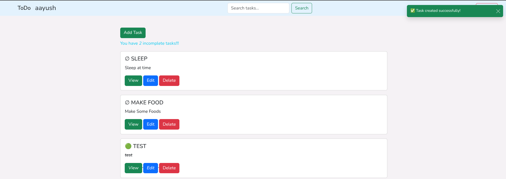
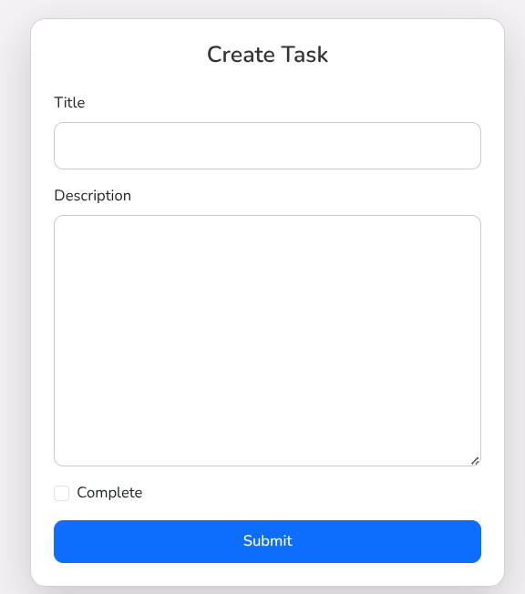
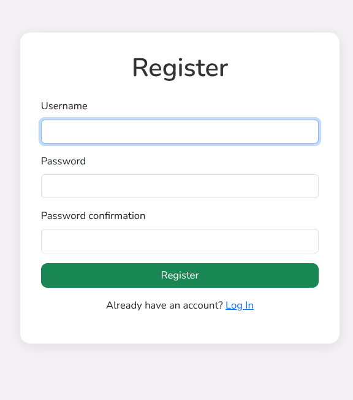

# 📝 ToDo App — Django + Bootstrap

A clean and responsive **ToDo Web App** built with Django and styled using Bootstrap 5. It includes user login/register, task management (CRUD), toast notifications, modal popups for delete confirmations, and a beautiful UI.


---

## ✨ Features

- 🔐 User Authentication – Register / Login / Logout  
- 📋 Task Management – Create, View, Update, and Delete tasks  
- 🎨 Responsive UI – Powered by Bootstrap 5  
- 🗑️ Delete Confirmation – Using Bootstrap modals  
- 🔔 Toast Notifications – For task actions (create, delete)  
- 🔍 Search Tasks – Filter tasks by title  
- 👤 User-Specific – Each user sees only their tasks  

---

## 📸 Screenshots

| Task List | Create Task | Register |
|-----------|-------------|----------|
|  |  |  |

---

## ⚙️ Tech Stack

- **Backend**: Django 5.2.4, Python 3.13.5  
- **Frontend**: Bootstrap 5, HTML5, CSS3  
- **Database**: SQLite  
- **Others**: Django Messages, Class-Based Views (CBV)  

---

## 🚀 Getting Started

Follow these steps to run the project locally:

### 1. Clone the Repository

```bash
git clone https://github.com/aayush-12321/ToDo.git
cd ToDo
```

### 2. Create and Activate a Virtual Environment

```bash
python -m venv env
source env/bin/activate     # On Windows: env\Scripts\activate
```

### 3. Install Dependencies

```bash
pip install -r requirements.txt
```

### 4. Apply Migrations

```bash
python manage.py migrate
```

### 5. Run the Development Server

```bash
python manage.py runserver
```

Open your browser and visit: [http://127.0.0.1:8000/](http://127.0.0.1:8000/)

---


## 📜 License

This project is licensed under the **MIT License**.  
Feel free to fork, use, and contribute to it.

---

## 🙌 Contributing

Pull requests are welcome! If you have ideas to improve the app, feel free to open an issue or PR.

If you find this project useful, consider giving it a ⭐ on GitHub!